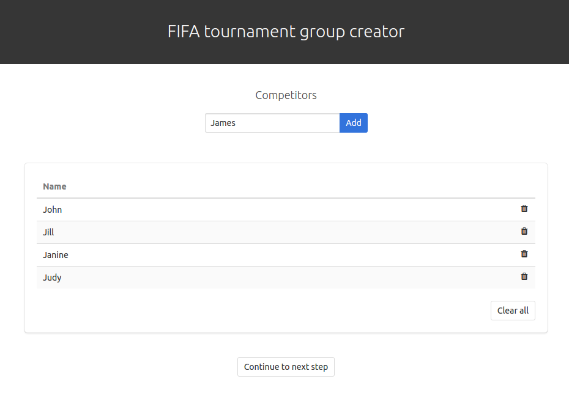

# FIFA group creator

> Create FIFA tournament groups - powered by vue.js and node.js

## Build Setup

``` bash
# install dependencies
npm install

# serve vue with hot reload at localhost:8080
npm run dev

# start node.js backend
npm start
```

## How it looks like
*Add competitors*


*Adjust options*


*Draw*


## Credits
- https://www.fifaindex.com/ for their work of providing all the information.
